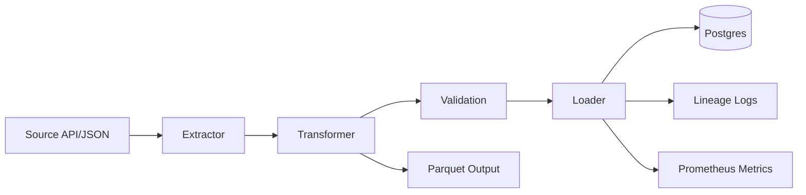

# Production-Grade Orders Data Pipeline

A batch data pipeline for ingesting, validating, transforming, loading, and observing order data for analytics workloads.

## Production Readiness

- Config-driven execution with environment overrides.
- Source ingestion from local JSON files or HTTP JSON APIs.
- Typed configuration and order payload validation with Pydantic.
- Quality checks before warehouse loading.
- Idempotent local runs with SQLite and Docker Compose PostgreSQL support.
- Parquet snapshots, JSONL lineage events, and Prometheus counters.
- CI checks for linting, unit/integration tests, Docker image build, and secret scanning.
- No committed runtime secrets. Local credentials are supplied through `.env`, which is git-ignored.

## Architecture



See [docs/architecture.md](docs/architecture.md) for component responsibilities and runtime flow.

## Project Structure

```text
configs/                 Environment-specific YAML config
dags/                    Optional scheduler DAG wrapper
data/                    Runtime input/output directories
mock_api/                Local HTTP source fixture
scripts/                 Repository maintenance checks
sql/                     Warehouse initialization SQL
src/my_project/          Pipeline package
tests/                   Unit and integration tests
.github/workflows/       CI, security, and local Compose deployment workflows
```

## Local Python Run

```bash
python -m pip install --upgrade pip
pip install -e ".[dev]"
PYTHONPATH=src python -m my_project.cli run --env dev
```

## Local Docker Compose Deployment

Create a local environment file from the example and set a local-only password:

```bash
cp .env.example .env
```

Edit `.env` and replace `POSTGRES_PASSWORD=replace-with-local-password`.

Run the full local stack:

```bash
docker compose up --build -d postgres mock-api
docker compose run --rm pipeline
```

Stop the stack:

```bash
docker compose down --remove-orphans
```

## Validation

```bash
make check
docker compose build pipeline
```

The secret scan checks repository text files for common credential patterns, private keys, credential-bearing URLs, and high-entropy token candidates.

## Configuration

- Base configuration lives in `configs/base.yaml`.
- Environment overlays live in `configs/dev.yaml`, `configs/docker.yaml`, and `configs/prod.yaml`.
- Runtime overrides use environment variables such as `SOURCE_URL`, `WAREHOUSE_DB_URL`, `WAREHOUSE_TABLE_NAME`, and `LINEAGE_PATH`.
- `SOURCE_AUTH_TOKEN` is supported but redacted from `show-config`.
- Database passwords in SQLAlchemy URLs are redacted from `show-config`.
- Sensitive query parameters in source URLs are redacted from config output, exceptions, and lineage events.

## CI/CD

GitHub Actions workflows:

- `CI`: lint, tests, and Docker image build.
- `Security`: repository secret scan.
- `CD`: self-hosted local Docker Compose deployment on `main` or manual dispatch.

The CD workflow expects a GitHub Actions environment secret named `POSTGRES_PASSWORD`. Optional environment variables include `POSTGRES_DB`, `POSTGRES_USER`, `POSTGRES_PORT`, `MOCK_API_PORT`, and `WAREHOUSE_TABLE_NAME`.

## Outputs

- Warehouse table in SQLite or PostgreSQL.
- Parquet snapshot at `data/processed/orders.parquet`.
- Lineage log at `data/processed/lineage.jsonl`.
- Prometheus counters exposed in process for pipeline runs, extracted rows, and loaded rows.
