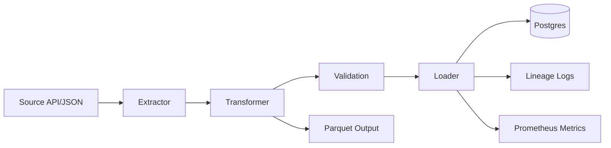

# Architecture

This document makes the pipeline topology explicit and maps each stage to the source modules that implement it.

## System Flow

## Components

- Source API/JSON: local JSON files or HTTP JSON endpoints configured through `SOURCE_URL`.
- Extractor: `src/my_project/extractors/orders_api.py` reads and normalizes source payload shape.
- Transformer: `src/my_project/transformers/clean_orders.py` validates records against the order model and deduplicates by `order_id`.
- Validation: `src/my_project/quality/orders.py` enforces required columns, non-negative amounts, non-null customers, and non-blank statuses.
- Loader: `src/my_project/loaders/warehouse.py` writes validated rows to SQLite or PostgreSQL and writes the Parquet snapshot.
- Lineage: `src/my_project/lineage/emitter.py` records a JSONL completion event with redacted source details.
- Metrics: `src/my_project/observability/metrics.py` records Prometheus counters for pipeline runs, extracted rows, and loaded rows.
- Orchestration: `src/my_project/orchestration/tasks.py` coordinates the end-to-end batch run.

## Runtime Modes

- Local Python mode uses `configs/dev.yaml` and defaults to SQLite-backed local output.
- Docker Compose mode uses `APP_ENV=docker`, `mock-api`, and PostgreSQL.
- Production mode is configured by environment variables and GitHub Actions secrets rather than committed credentials.
